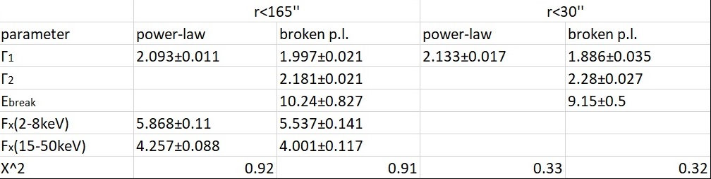

# Pulsar wind nebula spectral analysis

Results of spectral analysis of PWN G21.5 -0.9 emission

## Data
https://heasarc.gsfc.nasa.gov/FTP/nustar/data/obs/00/1//10002014003/
Obsid: 10002014003

## Based on paper
https://authors.library.caltech.edu/47453/1/0004-637X_789_1_72.pdf

### Data cleaning
https://heasarc.gsfc.nasa.gov/docs/nustar/analysis/nustar_quickstart_guide.pdf

<figure>
  <figtitle>Image of Pulsar wind nebula</figtitle>
  
</figure>

<figure>
  <figtitle>Light curve of Pulsar wind nebula</figtitle>
  
</figure>

<figure>
  <figtitle>X-ray spectrum of Pulsar wind nebula</figtitle>
  
</figure>

<figure>
  <figtitle>Fits of spectrum with different models</figtitle>
  
</figure>
